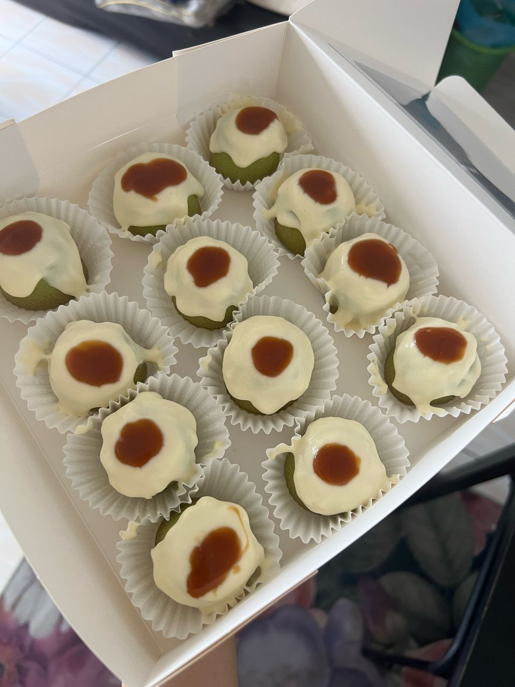
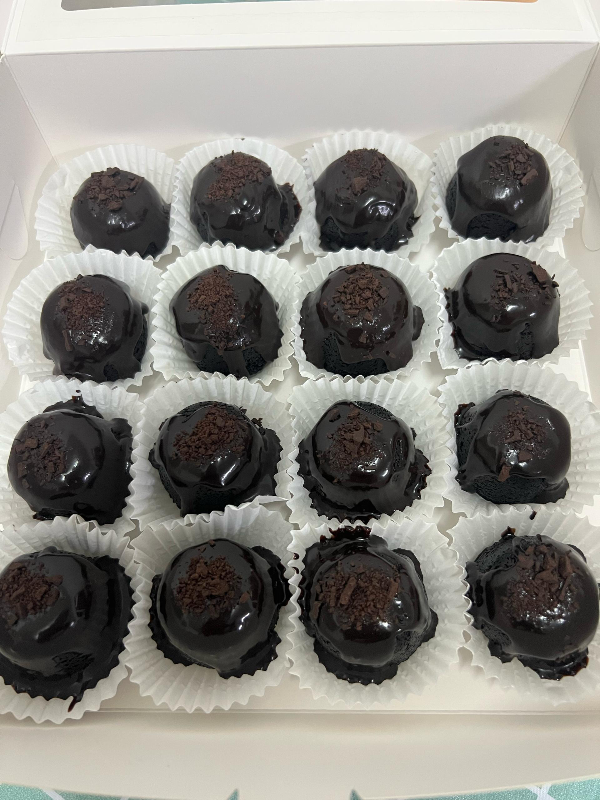
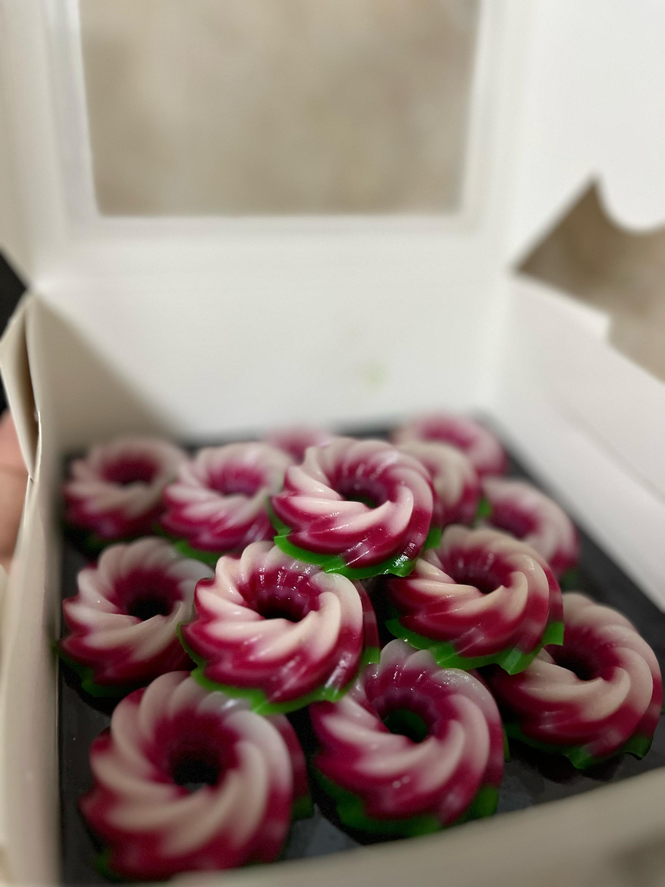
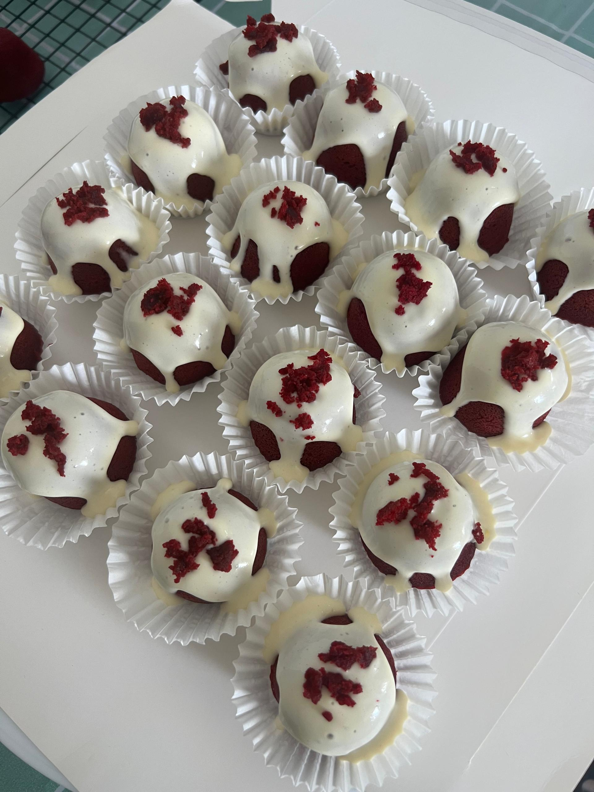

<!DOCTYPE html>
<html lang="en">
<head>
    <meta charset="UTF-8">
    <meta name="viewport" content="width=device-width, initial-scale=1.0">
    <title>Cake Delights</title>
    
</head>
<body>
    <header>Sweet Treats.MY</header>
    

        <h2>Our Menu</h2>
        

            
            
Pandan with Topping

      

        

    
    
Pandan with Topping

    
    
Choc Moist w/ Choc Topping

    
    
Kek Lapis Rainbow :)

    
    
Red Velvet w/ Choc Topping

        <h2>Order Sizes</h2>
        

            
Mini (14pcs)

            
5-inch Cake (Any Quantity)

            <a href="https://www.facebook.com/profile.php?id=61574507752791" class="order-button" target="_blank">Order on Facebook</a>
            <a href="https://www.instagram.com/sweettreats.my/" class="order-button" target="_blank">Order on Instagram</a>
        

    

</body>
</html>

